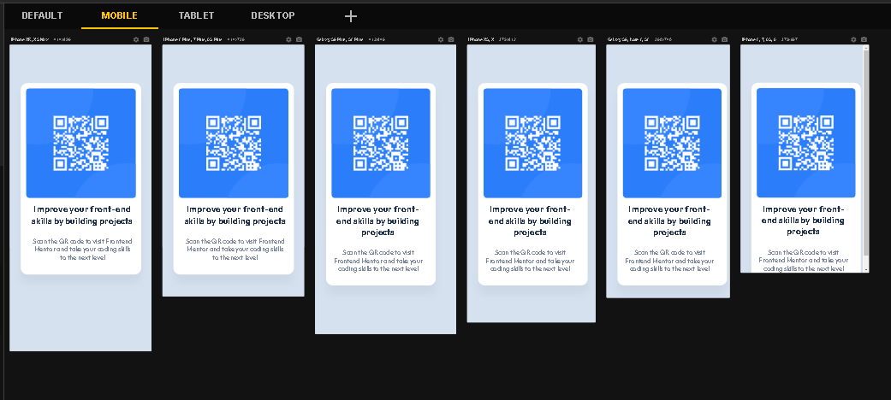

## Table of contents

- [Overview](#overview)
  - The challenge is to build out this qr-code and get it looking as close to the design as possible.
  - 
  - [Links](#links)
- My process: It took me 3 days to build this.
  - Built with: HTML5 and CSS3.
  - What I learned: I've learned how to use position, and more about mobile first. 
- Author: Natali Marinho. 

### The challenge

Users should be able to:

- View the optimal layout for the app depending on their device's screen size 

### Screenshot

### Built with

- Semantic HTML5 markup
- CSS custom properties
- Position
- Mobile-first workflow

## Author
- Frontend Mentor - [@natsmarinho](https://www.frontendmentor.io/profile/natsmarinho)
- Twitter - [@natsmarinho](https://www.twitter.com/natsmarinho)
- Instagram - [@natsmarinho](https://www.instagram.com/natsmarinho/)
- Linkedin - [@natsmarinho](https://www.linkedin.com/in/natsmarinho)

## Acknowledgments

I want to thank to my mentor Carlos Henrique for being a rather good and patient master. 
